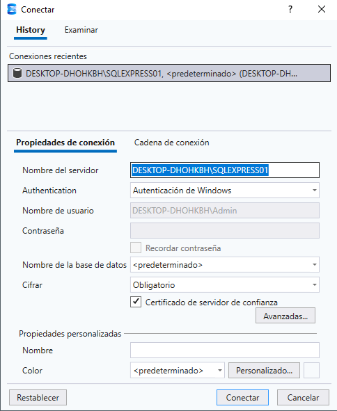
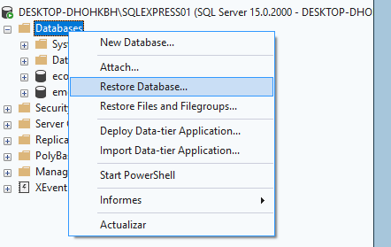
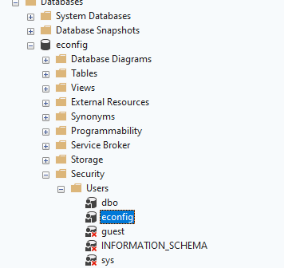
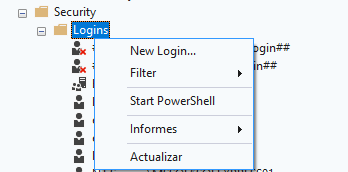
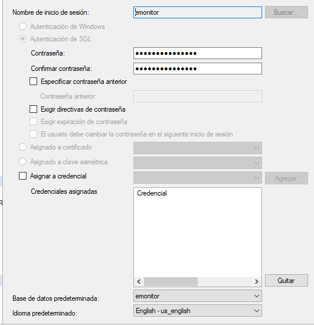
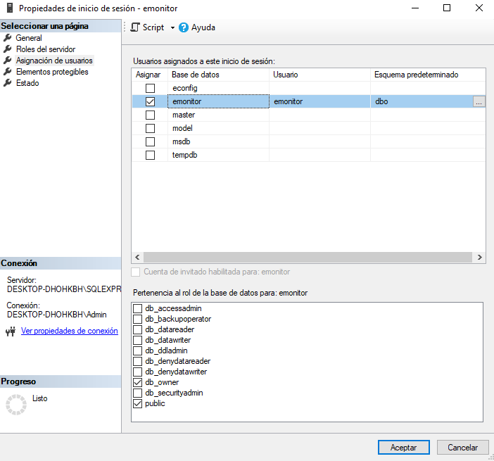
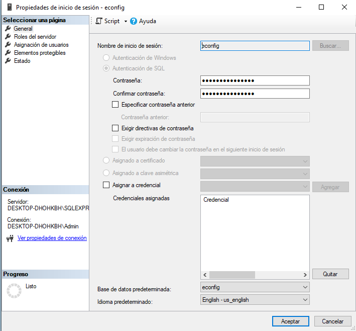
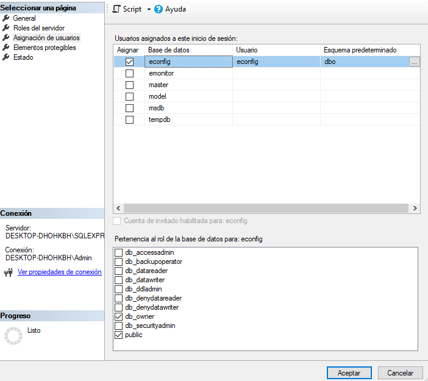
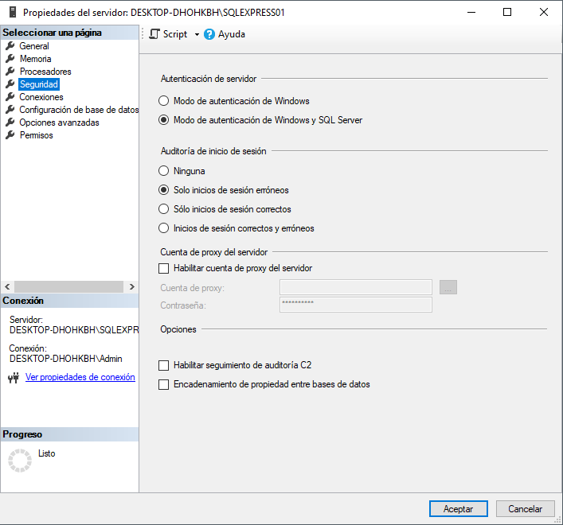

# Instalación y Preparación de Microsoft SQL Server para Emonitor

## 1. Objetivo

Configurar el motor de base de datos Microsoft SQL Server requerido para la instalación y operación de Emonitor 4.2, asegurando la correcta creación de bases de datos, usuarios y conectividad.

---

## 2. Requisitos Previos

- Microsoft SQL Server 2017 o 2019
- Acceso a Microsoft SQL Server Management Studio (SSMS)
- Archivos de respaldo:
  - `emonitor.bak`
  - `econfig.bak`

> Nota: Si se está actualizando desde una versión anterior de Emonitor, se recomienda realizar un respaldo completo de las bases de datos existentes antes de continuar.

---

## 3. Instalación de SQL Server

La instalación de SQL Server debe realizarse conforme a la documentación oficial de Microsoft. Se recomienda que esta tarea sea ejecutada por un administrador de bases de datos.

Durante la instalación, asegurar:

- Instalación del componente **Database Engine Services**
- Configuración adecuada del sistema operativo compatible
- Servidor operativo y accesible en red

---

## 4. Configuración del Servidor SQL

### 4.1 Habilitación de TCP/IP

Es obligatorio habilitar el protocolo TCP/IP para permitir la comunicación con Emonitor.

Pasos:

1. Abrir **SQL Server Configuration Manager**
2. Ir a:
    - SQL Server Network Configuration
3. Habilitar:
    - TCP/IP
4. Reiniciar el servicio de SQL Server

---

## 5. Creación de Bases de Datos

Las bases de datos de Emonitor se crean restaurando archivos de respaldo proporcionados por el instalador.

### 5.1 Ubicación de archivos

Ruta:

- `C:\Backups\Emonitor`

Archivos requeridos:

- `emonitor.bak`
- `econfig.bak`

---

### 5.2 Restauración de bases de datos

1. Copiar los archivos `.bak` a una carpeta local del servidor SQL
2. Abrir **SQL Server Management Studio (SSMS)**
3. Conectarse al servidor SQL
{ .center }
4. En **Object Explorer**
   - Click derecho en **Databases**
   - Seleccionar **Restore Database**
   { .center }
5. Seleccionar **Device**
   - Luego hacer clic en `...`
6. Seleccionar **Add** y cargar el archivo `emonitor.bak`
7. Confirmar con **OK**
8. Repetir el proceso para `econfig.bak`

---

## 6. Obtención del Nombre del Servidor

Durante la conexión en SSMS:

- Copiar el nombre completo del servidor SQL
- Este valor será requerido durante la instalación de Emonitor
{ .center }
Ejemplo:

- `SERVIDOR_SQL\SQLEXPRESS`

---

## 7. Creación de Logins y Usuarios

Se deben crear usuarios independientes para cada base de datos.
Al restaurar las bases de datos de Emonitor, estas pueden contener usuarios previamente configurados dentro del respaldo.

Sin embargo, se recomienda eliminar estos usuarios y recrearlos manualmente siguiendo el procedimiento establecido en este documento. Esto garantiza que:

- La configuración de autenticación sea correcta
- Los permisos estén adecuadamente asignados
- No existan inconsistencias entre logins y usuarios en SQL Server

Esta práctica evita errores comunes relacionados con accesos, conflictos de seguridad o problemas de conexión entre Emonitor y la base de datos.
{ .center }

---

### 7.1 Usuario para base de datos Emonitor

1. En **Object Explorer**:
   - Expandir **Security**
   - Click derecho en **Logins**
   - Seleccionar **New Login**
   { .center }
2. Configurar:
   - Login name: `Emonitor`
   - Authentication: SQL Server Authentication
   - Password: (definir contraseña segura)
{ .center }

  > Recomendación: usar máximo 16 caracteres alfanuméricos

3. Desactivar: Enforce Password Policy

4. En **Default database**: Seleccionar: `Emonitor`

---

### 7.2 Asignación de permisos

1. Ir a: **User Mapping**
2. Marcar: Base de datos `Emonitor`
3. En roles: Seleccionar `db_owner`
{ .center }
4. Confirmar con **OK**

---

### 7.3 Usuario para base de datos EConfig

Repetir el mismo procedimiento anterior con:

- Login name: `EConfig`
{ .center }
- Base de datos: `Econfig`
{ .center }
- Rol: `db_owner`

---

## 8. Consideraciones Importantes

- Es obligatorio instalar Emonitor antes de completar la configuración total del sistema
- Verificar que las bases de datos se restauraron correctamente
- Confirmar que los usuarios tienen permisos adecuados
- Validar conectividad mediante TCP/IP
### Configuración del modo de autenticación en SQL Server

Durante la configuración del servidor SQL, es necesario habilitar el modo de autenticación adecuado para permitir la conexión con Emonitor.

En la ventana de **Propiedades del servidor**, dentro de la sección **Seguridad**, se debe seleccionar:

- **Modo de autenticación de Windows y SQL Server**
Este modo, también conocido como *Mixed Mode*, permite:

- Autenticación mediante cuentas de Windows
- Autenticación mediante credenciales propias de SQL Server

Esto es necesario debido a que Emonitor utiliza autenticación SQL para conectarse a las bases de datos.
{ .center }
---

### Importancia de la configuración

Si únicamente se habilita el modo de autenticación de Windows:

- No será posible utilizar usuarios como `Emonitor` o `EConfig`
- Se generarán errores de conexión durante la configuración del sistema
- La aplicación no podrá acceder a las bases de datos

---

### Recomendación

Después de realizar este cambio, es necesario:

- Reiniciar el servicio de SQL Server
- Verificar que los logins creados funcionen correctamente

---

## 9. Validación

Se debe verificar:

- Existencia de bases de datos:
  - Emonitor
  - Econfig
- Usuarios creados correctamente
- Permisos asignados (db_owner)
- Conectividad desde Emonitor

---

## 10. Buenas Prácticas

- Realizar backups periódicos
- No utilizar el usuario `sa` para conexiones de aplicación
- Mantener control de accesos
- Documentar credenciales en entorno seguro
