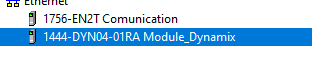
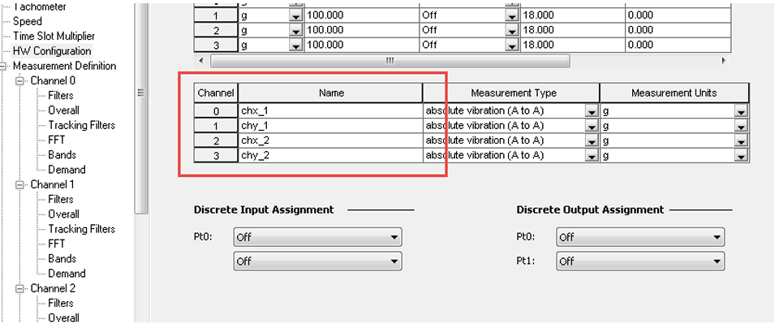

# Conexión con PLC

## Configuración en Studio 5000

1. Abrir el proyecto correspondiente en Studio 5000 Logix Designer.
2. Agregar el módulo Dynamix al árbol de E/S (I/O Configuration).
{ .center }
3. Configurar la dirección IP del dispositivo de acuerdo con la arquitectura de red establecida.
4. Verificar que el módulo se encuentre en estado operativo y sin errores de comunicación.

## Configuración de Variables

Verificar la disponibilidad de las variables que serán utilizadas para el monitoreo y diagnóstico del sistema, incluyendo:

* Variables de vibración.
* Variables de estado del dispositivo.
* Variables de alarma y eventos.
* Variables de diagnóstico, si corresponde.
{ .center }

## Configuración de la Comunicación

1. Confirmar que la comunicación entre el controlador y el módulo Dynamix se realice mediante el protocolo Ethernet/IP.
{ .center }
2. Verificar la correcta asignación de las conexiones de entrada y salida del módulo.
3. Descargar la configuración al controlador y validar que no existan fallas de comunicación.

## Validación de la Integración

1. Colocar el sistema en operación.
2. Verificar en el PLC la recepción y actualización de los datos provenientes del módulo Dynamix.
3. Confirmar que las variables de vibración, estado y alarmas presenten valores coherentes.
4. Acceder a Emonitor y verificar que las mediciones sean recibidas correctamente.
5. Confirmar la actualización de los datos en tiempo real y la correcta asociación de los puntos de medición configurados.
